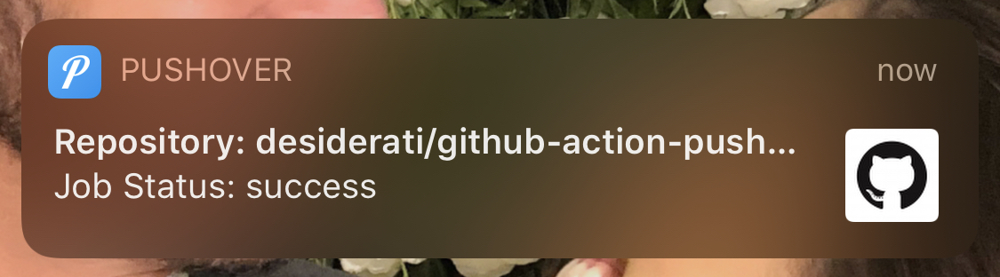

## GitHub Action for Pushover Notifications

[](https://github.com/desiderati/github-action-pushover/actions)
[](https://github.com/desiderati/github-action-pushover/releases)
[](https://github.com/desiderati/github-action-pushover/)
[](https://github.com/desiderati/github-action-pushover/blob/master/LICENSE)

## Documentation

#### Setup the GitHub Action:

1. First create the [Pushover Application](https://pushover.net/) and get the API Token and User Key.

2. Create the GitHub Action by adding the following to your `.github/workflows/buildspec.yml`.

```yml
name: Build

on:
  # It triggers the workflow when executing the push or pull request operation, but only for the master branch.
  push:
    branches:
      - master

  pull_request:
    branches:
      - master

jobs:
  build:
    runs-on: ubuntu-latest
    steps:
      - name: Checkout Code
        uses: actions/checkout@v2

     ...

      - name: Push Build Status Notifications
        if: ${{ always() }}
        uses: desiderati/github-action-pushover@v1
        with:
          job-status: ${{ job.status }}
          pushover-api-token: ${{ secrets.PUSHOVER_API_TOKEN }}
          pushover-user-key: ${{ secrets.PUSHOVER_USER_KEY }}
```

3. Add the Pushover API Token as `PUSHOVER_API_TOKEN` and user key as `PUSHOVER_USER_KEY` in *GitHub Repository >
   Settings > Secrets*.

4. Validate if you received the notification.



## Versioning

For transparency into our release cycle and in striving to maintain backward compatibility, GitHub Action for Pushover
Notifications is maintained under the [Semantic Versioning guidelines](https://semver.org/) and the release process is
predictable and business-friendly.

See the [Releases section of our GitHub project](https://github.com/desiderati/github-action-pushover/releases) for
change logs for each release version of GitHub Action for Pushover Notifications. It contains summaries of the most
noteworthy changes made in each release.

## Bug tracker

If you have any suggestions, bug reports, or annoyances please report them to our issue tracker
at https://github.com/desiderati/github-action-pushover/issues

## License

Copyright (c) 2019 - Felipe Desiderati - Released under [MIT License](https://opensource.org/licenses/mit-license.php).
